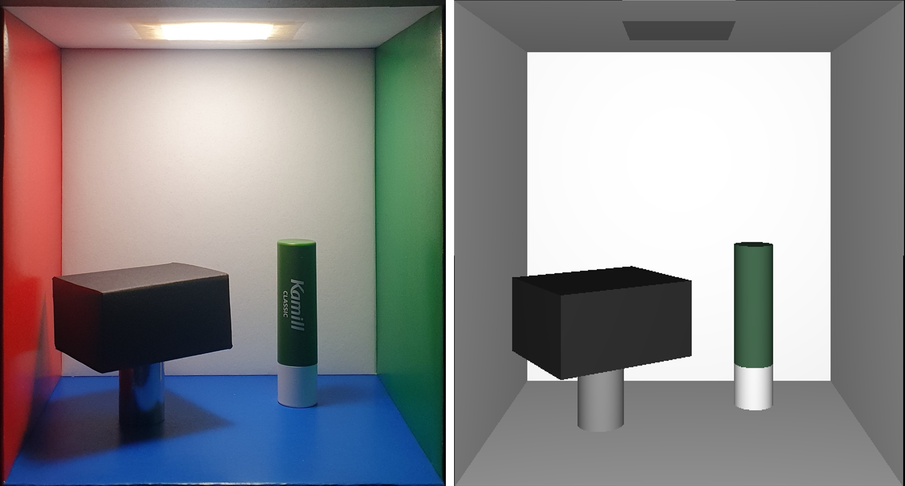

# Moon's Cornell Box

This is a modified version of a cornell box setup implemented using pyglet. Cornell box is a famous test task in computer graphics field, where you try to render photo-realistic image that mimics a highly-controlled real-world scene([example](https://en.wikipedia.org/wiki/Cornell_box)). 

Codes are written by a Mechanical Engineering undergraduate student in SNU, as a homework project. Camera codes and basic skeletons are referenced from [SNU_ComputerGraphics](https://github.com/SNU-IntelligentMotionLab/SNU_ComputerGraphics_).

## Requirements

This code uses [Pyglet](https://github.com/pyglet/pyglet) which is a cross-platform windowing library under Python 3.8+. 
Supported platforms are:

* Windows 7 or later
* Mac OS X 10.3 or later
* Linux

## Installation

First, download miniconda(recommended) or anaconda.
- **[Download Miniconda](https://www.anaconda.com/docs/getting-started/miniconda/install)**
- [Download Anaconda](https://docs.conda.io/projects/conda/en/latest/user-guide/install/index.html)

Second, clone repository.

    git clone https://github.com/JMacoustic/MoonCornell.git

Finally, go into the cloned repo and create environment.
    
    cd path/to/cloned/repo/
    conda env create -f environment.yml

## Run

Now, simply activate conda environment and run the code.

    conda activate cornell_env
    python main.py

## How to play

1. Keyboard controls.
    - key 1: Return to initial view point

2. Mouse controls.
    - Grab-and-Drag: change the view by trackball viewer. It should be intuitive.
    - Scroll: zoom in and out.
